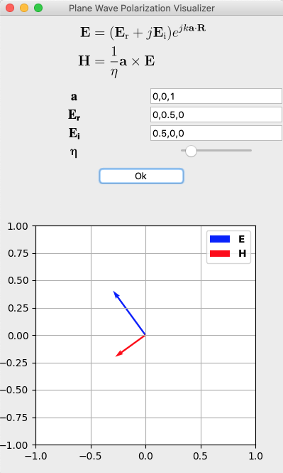

# Plane Wave Polarization Visualizer

Finding the polarization of a plane wave can be difficult. Especially determining the handiness of the wave can be time-taking. With this Python program, you can easily visualize the polarization of a plane wave with an animation.

To visualize the plane wave, you will have to input the following:
1. the propagation direction of the wave,
2. real and imaginary parts of the electric field,
3. the intrinsic impedance of the medium

You can input any propagation direction vector and electric field vector as long as they are orthogonal (dot product has to be zero).
The program rotates the fields so that the propagation direction is towards the Z-axis.

